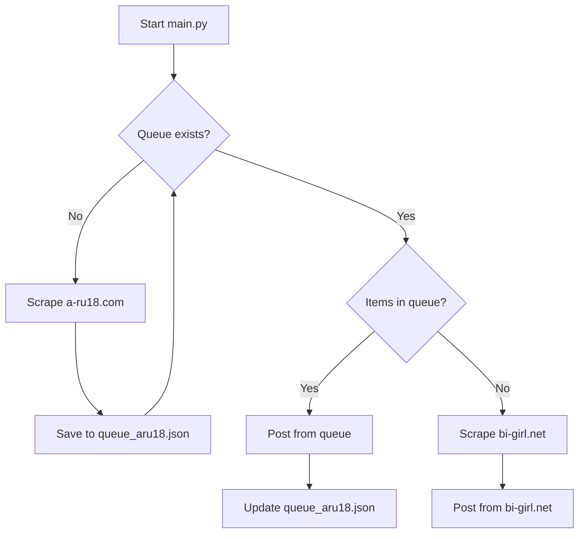

# Design Doc: a-ru18.com Integration (X Top 100)

## Goal
Integrate a new content source (`https://a-ru18.com/twitter-top100/`) and prioritize its items (100 actresses) in the automated posting pipeline.

## Current System
- Primary Source: `bi-girl.net` (paginated scraping).
- Tracking: `state.json` (current page) and `history.txt` (posted IDs).
- Output: Livedoor Blog (AtomPub API).

## Proposed Changes

### 1. New Scraper: `scraper_aru18.py`
- Target URL: `https://a-ru18.com/twitter-top100/`
- Logic:
    - Scrape actress names and X (Twitter) screen names.
    - Extract X ID from follow button or links.
    - Return a list of dicts: `[{"name": "...", "id": "..."}, ...]`

### 2. Queue Management: `queue_aru18.json`
- A JSON file acting as a persistent queue.
- Structure: `{"items": [{"name": "...", "id": "..."}, ...]}`
- If the file exists and is not empty, `main.py` will pull from it.

### 3. Workflow Modification (`main.py`)
- **Initialization**:
    - Load `queue_aru18.json`.
    - If file doesn't exist, try to scrape `a-ru18.com` once and create it.
- **Posting Logic**:
    - Check if `queue_aru18.json` has `items`.
    - If yes:
        - Pop up to 5 items.
        - Process each (DMM search -> Livedoor post).
        - Update `history.txt`.
        - Save remaining items back to `queue_aru18.json`.
    - If no (or empty):
        - Fallback to regular `bi-girl.net` scraping using `state.json`.

### 4. Integration Details
- **DMM Search**: Reuse `DMMClient` to fetch affiliate links for these 100 actresses.
- **Deduplication**: Check `history.txt` before posting from the queue. If someone from the Top 100 was already posted (from `bi-girl.net` in the past), skip them.

## Data Flow

## Error Handling
- If `a-ru18.com` scraping fails, log error and skip queue initialization (fallback to bi-girl).
- Ensure file locks or atomic writes for JSON files if needed (though GitHub Actions runs sequentially, so simple write is fine).

## Success Criteria
1. The script posts 5 actresses from the Top 100 every hour.
2. After 20 runs (~100 people), it automatically switches back to `bi-girl.net`.
3. No duplicate posts for people already in `history.txt`.
