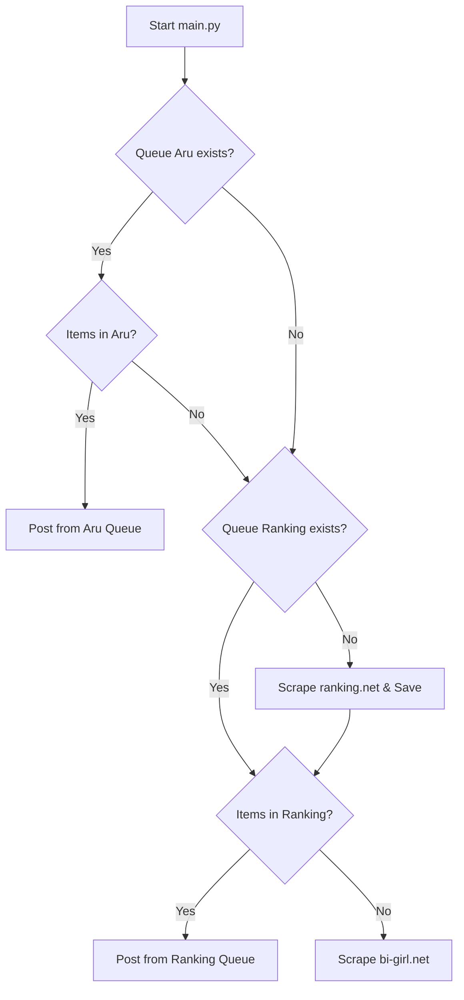

# Design Doc: ranking.net Integration (Gravure Idols)

## Goal
Integrate a second priority source (`https://ranking.net/twitter-follower-ranking/gravure-idol/woman`) into the automated posting pipeline, including X, Instagram, and TikTok accounts.

## Proposed Changes

### 1. New Scraper: `scraper_ranking_net.py`
- Target URL: `https://ranking.net/twitter-follower-ranking/gravure-idol/woman`
- Logic:
    - Handle pagination (up to 5 pages/100 items).
    - Extract:
        - Name
        - X (Twitter) screen name
        - Instagram account link
        - TikTok account link
    - Return a list of dicts: `[{"name": "...", "id": "...", "insta": "...", "tiktok": "..."}, ...]`

### 2. Multi-Queue Logic in `main.py`
- Priority Order:
    1. `queue_aru18.json` (A-RU18 Top 100)
    2. `queue_ranking_net.json` (Ranking.net Gravure Idols)
    3. `bi-girl.net` (Regular paginated source)

### 3. Template Enhancement
- Add links for Instagram and TikTok if available in the item data.

## Data Flow

## Success Criteria
1. The script processes the first 100 from A-RU18.
2. Once A-RU18 is empty, it automatically starts posting from Ranking.net.
3. Posts from Ranking.net include Instagram and TikTok links.
